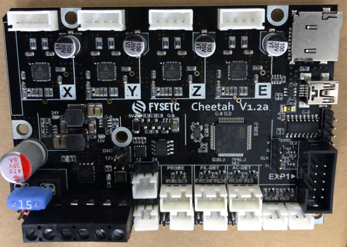
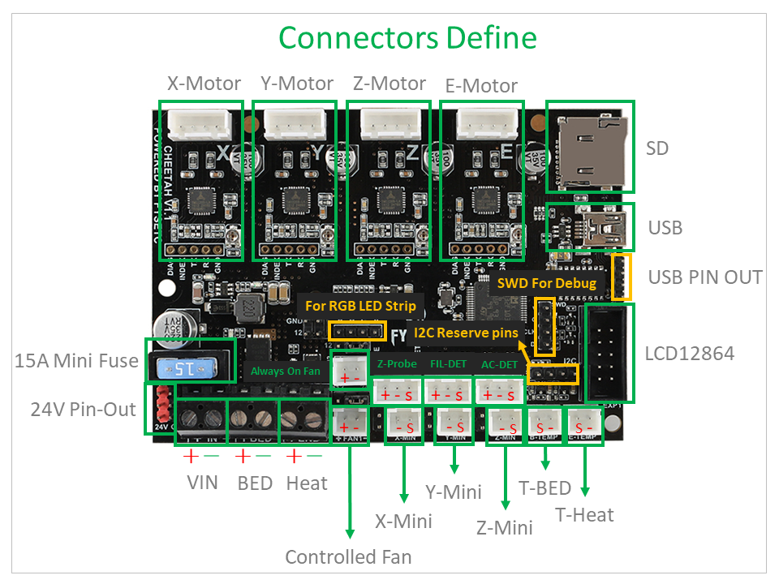
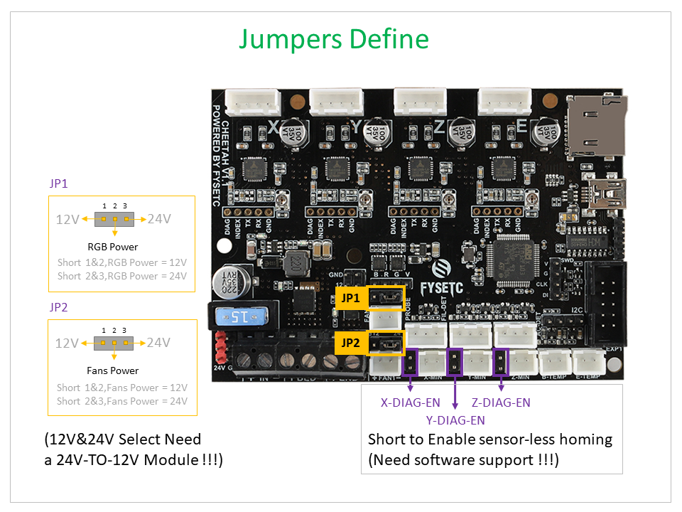

## 1. Product Introduction



Designed for a single-head 3D printer, many interfaces are reserved for more features. Such as AC detection, filament detection, leveling with BL-touch or other sensors.

## 2. Features

- Compact size: 101.5mm x 72mm，Compatible with the Creatlity ender 3 motherboard size

- fully integrated all in one solution:
  
  - STM32F103 MCU (Run Marlin 2.0 )
  - CH340 for high speed USB serial connection 
  - (V1.1)4X TMC2209 stepper drivers, Support sensor-less homing
  - (V1.2)4X TMC2208 stepper drivers, not support sensor-less homing

- UNIVERSAL POWER:
  
  - can be used with 7V-35V for motors / heated bed
  - (V1.2)24V to 12V/2A DC-DC for fans
  - integrated high precision power regulators (DC/DC):  5V 1A Max and 3.3V  600mA Max LDO

- Onboard TF card socket

- EXP1 for 12864 display panel (Creality 12864 panel or FYSETC Generic12864)

- Onboard RGB control (V1.2 have no RGB control)

- RGB control and fan control 12V/24V optional (Requires 24V to 12V module)

- PCB：
  
  - High quality, High temperature FR4-TG130 PCB
  - Gold ENIG finishing

## 3. Application

- 3D printer 
- CNC Device
- Other similar machines

## 4. Hardware

### 4.1 Hardware Reasources

| Board Name           | Cheetah                            |
| -------------------- | ---------------------------------- |
| License              | GPL V2.0                           |
| Latest Version       | V1.0                               |
| Extruders            | 1                                  |
| Fixed Fans           | 2 Max                              |
| Controlled Fans      | 1 Max                              |
| Heaters              | 1 Max                              |
| Endstops             | 3 Max                              |
| Temp sens            | 2 Max                              |
| I2C                  | 1                                  |
| SWD                  | 1                                  |
| Serial port chip     | CH340                              |
| CPU                  | STM32F103                          |
| CPU Speed ( MHz )    | 72 Mhz                             |
| Stepper driver       | 4X TMC2209 (V1.2 = 2208)           |
| Stepper driver  Type | Onboard                            |
| Input                | 12v/24v                            |
| Output               | BED OUT：10A Max ；Heater Out：5A Max |

### 4.2 Connectors and jumpers define(V1.1)




### 4.3 Connectors and jumpers define(V1.2)

Not available.

### 4.4 Pin Definition

#### 4.4.1 Cheetah V1.1

<table>
   <tr><td>Features</td><td>Cheetah Pin</td><td>STM32 Pin</td><td>Pin No.</td><td>Comment</td></tr>
   <tr><td rowspan="3">X-MOTOR(1)</td><td>X-Step</td><td>PB8</td><td>61</td><td></td></tr>
   <tr><td>X-DIR</td><td>PB9</td><td>62</td><td></td></tr>
   <tr><td>X-EN</td><td>PA8</td><td>41</td><td></td></tr>
   <tr><td rowspan="3">Y-MOTOR(2)</td><td>Y-Step</td><td>PB2</td><td>28</td><td></td></tr>
   <tr><td>Y-DIR</td><td>PB3</td><td>55</td><td></td></tr>
   <tr><td>Y-EN</td><td>PB1</td><td>27</td><td></td></tr>
   <tr><td rowspan="3">Z-MOTOR(3)</td><td>Z-Step</td><td>PC0</td><td>8</td><td></td></tr>
   <tr><td>Z-DIR</td><td>PC1</td><td>9</td><td></td></tr>
   <tr><td>Z-EN</td><td>PC2</td><td>10</td><td></td></tr>
   <tr><td rowspan="3">E0-MOTOR(4)</td><td>E0-Step</td><td>PC15</td><td>4</td><td></td></tr>
   <tr><td>E0-DIR</td><td>PC14</td><td>3</td><td></td></tr>
   <tr><td>E0-EN</td><td>PC13</td><td>2</td><td></td></tr>
   <tr><td rowspan="2">TMC2209 SERIAL (UART2)</td><td>TX2</td><td>PA2</td><td>16</td><td></td></tr>
   <tr><td>RX2</td><td>PA3</td><td>17</td><td></td></tr>
   <tr><td rowspan="3">End-stops</td><td>X-MIN</td><td>PA1</td><td>15</td><td></td></tr>
   <tr><td>Y-MIN</td><td>PB4</td><td>56</td><td></td></tr>
   <tr><td>Z-MIN</td><td>PA15</td><td>50</td><td></td></tr>
   <tr><td rowspan="1">FAN</td><td>FAN0</td><td>PC8</td><td>39</td><td></td></tr>
   <tr><td rowspan="3">RGB</td><td>LED-R</td><td>PB0</td><td>26</td><td>Can be used for fan1</td></tr>
   <tr><td>LED-G</td><td>PB7</td><td>59</td><td>Can be used for fan2</td></tr>
   <tr><td>LED-B</td><td>PB6</td><td>58</td><td>Can be used for fan3</td></tr>
   <tr><td rowspan="2">Heating</td><td>E0-Heater</td><td>PC6</td><td>37</td><td></td></tr>
   <tr><td>Heated-Bed</td><td>PC7</td><td>38</td><td></td></tr>
   <tr><td rowspan="2">Temperature</td><td>TE0</td><td>PC4</td><td>15</td><td></td></tr>
   <tr><td>TB</td><td>PC5</td><td>18</td><td></td></tr>
   <tr><td rowspan="8">EXP1</td><td>BEEP</td><td>PC9</td><td>40</td><td></td></tr>
   <tr><td>BTN_ENC</td><td>PC12</td><td>53</td><td></td></tr>
   <tr><td>BTN_EN2</td><td>PC11</td><td>52</td><td></td></tr>
   <tr><td>MISO</td><td>PA6/MISO2</td><td>22</td><td></td></tr>
   <tr><td>BTN_EN1</td><td>PC10</td><td>51</td><td></td></tr>
   <tr><td>SCK</td><td>PA5/SCK2</td><td>21</td><td></td></tr>
   <tr><td>CS</td><td>PA4</td><td>20</td><td></td></tr>
   <tr><td>MOSI</td><td>PA7/MOSI2</td><td>23</td><td></td></tr>
   <tr><td rowspan="2">UART</td><td>TX</td><td>PA9/TX1</td><td>42</td><td></td></tr>
   <tr><td>RX</td><td>PA10/RX1</td><td>43</td><td></td></tr>
   <tr><td rowspan="2">I2C</td><td>I2C2 SCL</td><td>PB10</td><td>29</td><td></td></tr>
   <tr><td>I2C2 SDA</td><td>PB11</td><td>30</td><td></td></tr>
   <tr><td rowspan="3">SWD Debug</td><td>SWDIO</td><td>PA13</td><td>72</td><td>only used for debugging now and can be used for other purposes.</td></tr>
   <tr><td>SWCLK</td><td>PA14</td><td>76</td><td>only used for debugging now and can be used for other purposes.</td></tr>
</table>

#### 4.4.2 Cheetah V1.2

<table>
   <tr><td>Features</td><td>Cheetah Pin</td><td>STM32 Pin</td><td>Pin No.</td><td>Comment</td></tr>
   <tr><td rowspan="3">X-MOTOR(1)</td><td>X-Step</td><td>PB8</td><td>61</td><td></td></tr>
   <tr><td>X-DIR</td><td>PB9</td><td>62</td><td></td></tr>
   <tr><td>X-EN</td><td>PA8</td><td>41</td><td></td></tr>
   <tr><td rowspan="3">Y-MOTOR(2)</td><td>Y-Step</td><td>PB2</td><td>28</td><td></td></tr>
   <tr><td>Y-DIR</td><td>PB3</td><td>55</td><td></td></tr>
   <tr><td>Y-EN</td><td>PB1</td><td>27</td><td></td></tr>
   <tr><td rowspan="3">Z-MOTOR(3)</td><td>Z-Step</td><td>PC0</td><td>8</td><td></td></tr>
   <tr><td>Z-DIR</td><td>PC1</td><td>9</td><td></td></tr>
   <tr><td>Z-EN</td><td>PC2</td><td>10</td><td></td></tr>
   <tr><td rowspan="3">E0-MOTOR(4)</td><td>E0-Step</td><td>PC15</td><td>4</td><td></td></tr>
   <tr><td>E0-DIR</td><td>PC14</td><td>3</td><td></td></tr>
   <tr><td>E0-EN</td><td>PC13</td><td>2</td><td></td></tr>
   <tr><td rowspan="8">TMC2208 SERIAL</td><td>X TX</td><td>PA11</td><td>44</td><td></td></tr>
   <tr><td>X RX</td><td>PA12</td><td>45</td><td></td></tr>
   <tr><td>Y TX</td><td>PB6</td><td>58</td><td></td></tr>
   <tr><td>Y RX</td><td>PB7</td><td>59</td><td></td></tr>
   <tr><td>Z TX</td><td>PB10</td><td>29</td><td></td></tr>
   <tr><td>Z RX</td><td>PB11</td><td>30</td><td></td></tr>
   <tr><td>E TX</td><td>PA2</td><td>16</td><td></td></tr>
   <tr><td>E RX</td><td>PA3</td><td>17</td><td></td></tr>
   <tr><td rowspan="3">End-stops</td><td>X-MIN</td><td>PA1</td><td>15</td><td></td></tr>
   <tr><td>Y-MIN</td><td>PB4</td><td>56</td><td></td></tr>
   <tr><td>Z-MIN</td><td>PA15</td><td>50</td><td></td></tr>
   <tr><td rowspan="2">FAN</td><td>FAN0</td><td>PC8</td><td>39</td><td></td></tr>
   <tr><td>FAN1</td><td>PB0</td><td>26</td><td></td></tr>
   <tr><td rowspan="2">Heating</td><td>E0-Heater</td><td>PC6</td><td>37</td><td></td></tr>
   <tr><td>Heated-Bed</td><td>PC7</td><td>38</td><td></td></tr>
   <tr><td rowspan="2">Temperature</td><td>TE0</td><td>PC4</td><td>15</td><td></td></tr>
   <tr><td>TB</td><td>PC5</td><td>18</td><td></td></tr>
   <tr><td rowspan="8">EXP1</td><td>BEEP</td><td>PC9</td><td>40</td><td></td></tr>
   <tr><td>BTN_ENC</td><td>PC12</td><td>53</td><td></td></tr>
   <tr><td>BTN_EN2</td><td>PC11</td><td>52</td><td></td></tr>
   <tr><td>MISO</td><td>PA6/MISO2</td><td>22</td><td></td></tr>
   <tr><td>BTN_EN1</td><td>PC10</td><td>51</td><td></td></tr>
   <tr><td>SCK</td><td>PA5/SCK2</td><td>21</td><td></td></tr>
   <tr><td>CS</td><td>PA4</td><td>20</td><td></td></tr>
   <tr><td>MOSI</td><td>PA7/MOSI2</td><td>23</td><td></td></tr>
   <tr><td rowspan="2">UART</td><td>TX</td><td>PA9/TX1</td><td>42</td><td></td></tr>
   <tr><td>RX</td><td>PA10/RX1</td><td>43</td><td></td></tr>
   <tr><td rowspan="3">SWD Debug</td><td>SWDIO</td><td>PA13</td><td>72</td><td>only used for debugging now and can be used for other purposes.</td></tr>
   <tr><td>SWCLK</td><td>PA14</td><td>76</td><td>only used for debugging now and can be used for other purposes.</td></tr>
</table>

## 5. Firmware

### 5.1 Marlin

The FYSETC CHEETAH firmware is pre-config for ENDER3 machine, if you want to change the firmware or compile the code yourself , follow the steps.

#### 5.1.1 Download Vscode + platformio

To compile the firmware , you need to install Visual Studio Code and the platformio pulg-in.

#### 5.1.2 Firmware code

You have two code source choices :

##### Source 1

You can get Marlin code is in the `firmware/Marlin` folder in this repository [github](https://github.com/FYSETC/FYSETC-Cheetah/tree/master/firmware/Marlin) or [gitee](https://gitee.com/fysetc/FYSETC-Cheetah/tree/master/firmware/Marlin). 

And change `MOTHERBOARD` define according to your cheetah board version in `Configuration.h`

Cheetah v1.1x

```
#define MOTHERBOARD BOARD_FYSETC_CHEETAH
```

Cheetah v1.2x

```
#define MOTHERBOARD BOARD_FYSETC_CHEETAH_V12
```

##### Source 2

Also you can get upstream branch from [github](https://github.com/MarlinFirmware/Marlin) or [gitee](https://gitee.com/fysetc/Marlin). But remember to change `default_envs` in `platformio.ini` file.

```
default_envs = STM32F103RC_fysetc
```

And change `MOTHERBOARD` define according to your cheetah board version in `Configuration.h`

Cheetah v1.1x

```
#define MOTHERBOARD BOARD_FYSETC_CHEETAH
```

Cheetah v1.2x

```
#define MOTHERBOARD BOARD_FYSETC_CHEETAH_V12
```

You'd better change your configuration base on the configuration on github [cheetah v1.1](https://github.com/MarlinFirmware/Configurations/tree/import-2.0.x/config/examples/Creality/Ender-3/FYSETC%20Cheetah)/[cheetah v1.2](https://github.com/MarlinFirmware/Configurations/tree/import-2.0.x/config/examples/Creality/Ender-3/FYSETC%20Cheetah%201.2) or gitee [cheetah v1.1](https://gitee.com/fysetc/Configurations/tree/import-2.0.x/config/examples/Creality/Ender-3/FYSETC%20Cheetah)/[cheetah v1.2](https://gitee.com/fysetc/Configurations/tree/import-2.0.x/config/examples/Creality/Ender-3/FYSETC%20Cheetah%201.2).

#### 5.1.3 Compile the firmware

Open Vscode and open platformio main page and click the "Open Project" button , and direct to the folder where you put your firmware.


If everything goes fine , at the bottom you can see several buttons


Just click check mark to compile.

Note: If you generate the hex file fail you may need to open vscode using Administrator Account .

### 5.2 Klipper

#### 5.2.1 Requirement

Our Cheetah board have CH341 chip, so you may need to install its driver. There are a lot of CH341 driver if you search on the internet, links below may help.

[Ch34x](https://github.com/gorgiaxx/CH34x-Driver-Linux)

#### 5.2.2 Compile firmware


If you want to use sdcard bootloader, you can follow the instructions [github](https://github.com/FYSETC/FYSETC-Cheetah/tree/master/bootloader) or [gitee](https://gitee.com/fysetc/FYSETC-Cheetah/tree/master/bootloader).

After you upload the firmware, please power down Cheetah first, then power on again.  And use the following octoprint parameter.


### 5.2.3 printer.cfg

You can change your config according to you machine base on the generic printer.cfg from Klipper [here(Cheetah_v1.1)](https://github.com/Klipper3d/klipper/blob/master/config/generic-fysetc-cheetah-v1.1.cfg) and [here(Cheetah_v.12)](https://github.com/Klipper3d/klipper/blob/master/config/generic-fysetc-cheetah-v1.2.cfg). Or our example config in `Firmware\Klipper\Cheetah**` folder [here](https://github.com/FYSETC/FYSETC-Cheetah/tree/master/firmware/Klipper/Cheetah-v1.2). 

### 5.3 Upload the firmware

We provide several methods for you to upload the firmware . But first, you need to install CH340x driver, please check here: [CH340 driver](https://www.wch.cn/search?t=all&q=CH340).

#### Method 1:  Upload the firmware with sdcard

You need to upload `bootloader` first, please follow the `README` in `bootloader` folder in this repository. Well, link is [github](https://github.com/FYSETC/FYSETC-Cheetah/tree/master/bootloader) or [gitee](https://gitee.com/fysetc/FYSETC-Cheetah/tree/master/bootloader).

#### Method 2: Upload the firmware(windows,linux,Mac) - for Marlin

This method only works for Marlin. You can just click the upload button in platformio to upload the firmware.


#### Method 3: Upload the firmware(windows)

This method only works in windows system. 

After compiling , you should see the firmware file `firmware.hex` in the folder `FIRMWARE_LOCATE\Marlin\Marlin\.pio\build\STM32F103RC_fysetc\`

You can follow the following steps to upload the firmware.

- Download the flash software in our [github](https://github.com/FYSETC/STM32Flasher) or [gitee](https://gitee.com/fysetc/STM32Flasher).

- Power the board with power supply and connect the board to your PC with USB cable

- Double the click "FlyMcu.exe" software


- Select `Reset@DTR low(<-3v),ISP @RTS High`

- Click "Port" to select the port of your USB 

- Select `firmware.hex` in the `Code File For Online ISP:` edit box. This the firmware you built. There is pre-build firmware file named `klipper.hex` on [github](https://github.com/FYSETC/FYSETC-Cheetah/tree/master/firmware/Klipper/Cheetah-v1.2) or [gitee](https://gitee.com/fysetc/FYSETC-Cheetah/tree/master/firmware/Klipper/Cheetah-v1.2). If you use marlin, pre-build firmware is on [github](https://github.com/FYSETC/FYSETC-Cheetah/tree/master/examples/Ender-3) or [gitee](https://gitee.com/fysetc/FYSETC-Cheetah/tree/master/examples/Ender-3).

- At last, click  `Start ISP(p)` button to upload the firmware.

#### Method 4: Upload the firmware(Klipper)

This method is only for Klipper firmware. According to the method from Klipper config file for Cheetah [here](https://github.com/KevinOConnor/klipper/blob/master/config/generic-fysetc-cheetah-v1.1.cfg) and [here](https://github.com/KevinOConnor/klipper/blob/master/config/generic-fysetc-cheetah-v1.2.cfg). You can run the command

```
stm32flash -w out/klipper.bin -v -i rts,-dtr,dtr /dev/ttyUSB0
```

#### Method 5: Upload the firmware(linux)

This method only works in Linux system.

- ##### Load usb driver

Delete the old version driver /lib/modules/$(uname -r)/kernel/drivers/usb/serial/ch341.ko

```
rm /lib/modules/$(uname -r)/kernel/drivers/usb/serial/ch341.ko
```

Download the CH34x driver(linux version) from our [github](https://github.com/FYSETC/CH340-Driver) or [gitee](https://gitee.com/fysetc/CH340-Driver).

Follow the `readme.txt` to make and load the driver.

If you want the driver load automatically every time your PC power up. You can copy the ch34x.ko file to 

directory /lib/modules/$(uname -r)/kernel/drivers/usb/serial/ , and do

```
depmod 
```

- ##### Install stm32flash tool

First get the code

```
git clone https://git.code.sf.net/p/stm32flash/code stm32flash-code
```

Then follow the INSTALL file to install the software

- ##### Upload the firmware

Connect the motherboard with USB cable and your PC. And do

```
dmesg
```

And you will get message like 


the ttyUSB0 is the port to communicate with the motherboard.

And then go the `firmware.hex` file location directory and do the follow command to upload the firmware

```
 stm32flash -w firmware.hex -v -i rts,-dtr /dev/ttyUSB0
```

## 6. Version

----------------

V1.1：

1. Initial version

V1.2a：

1. Change 2209 to 2208 and support 2208 UART mode
2. Add a controlled fan for hotend
3. And a 24 to 12V/2A Circuit for fans and mosfets
4. Add mosfet driver chip
5. Remove the RGB circuit and I2C pins
6. Change the 4P pin header（1.1 is USB pinout） to UART1
7. Fixed USB voltage reflow to PSU issue

V1.2b：

1. Fix some silks mark
2. Update MOSFET drive circuit

## 7. FAQ：

--------------------

### 1. Why use USB-TO-UART chip for USB？

We just want to give you a convenient way to update the firmware without having to think about which bootloader to use and how to jumper BOOT0&BOOT1.
Also, if your board is already installed in the machine, the jumper setting is more inconvenient for you.
So, by adding a chip that can solve the problem, why not do it?

### 2. Why does the USB power flow back to the PSU?

At the time of design, we thought that plugging in the USB is just to update the firmware, and at other times you will use the SD card for printing. Even if you use USB printing, it should be a short-time debugging.
Even, we found that most of the 2560 boards did the same, and nothing went wrong. This should be a way of testing over time.
Until TH3D promotes this problem in the whole world, I think this will cause confusion for many people, so I will solve this problem whether or not it will cause problems, and it was already solved on the 1.2a version.

### 3. The direction of the encoder is wrong？

First of all, this is not a hardware problem, we can adjust it through software, and it is very easy.
Secondly, there is no fixed standard in this direction, and different people may not like the same.
Finally, we have changed to the most favorite way, if you want to reverse, you can also set the firmware yourself.
***Note: In fact, our price is only the price of a hardware platform, we have never calculated the value of software, we think that as one of the contributors and users of marlin, we should follow the spirit of open source, make more people easier Get the convenience of open source. Instead of selling it with open source resources.***

### 4. The screen displays garbled characters？

First of all, we should know that low-voltage signals are easily interfered, so we should try to avoid the screen line and the high-voltage and high-current lines being too close.
In addition, our people usually have static electricity on their hands, and directly touch some electronic components, which may also affect normal signal transmission.
So if it is just an accidental phenomenon and it will disappear after re-power, then don't worry.
If it has been there, please contact us and we will deal with it according to the specific situation!

### 5. Y-motor got very hot

Actually there is an inappropriate firmware configuration.
You need to change

```
 #define CHOPPER_TIMING CHOPPER_DEFAULT_12V
```

to 

```
 #define CHOPPER_TIMING CHOPPER_DEFAULT_24V
```

### 6. Can't save config to eeprom

This is a firmware issue that has been fixed so far, you can fix it by upgrading the firmware.
For new firmware,the default config is not for cheetah board anymore as we have other boards to release and the need to build the firmware, you need to change default_envs to fysetc_STM32F1 in platformio.ini file and replace the configuration.h and configuration_adv.h file with FYSETC example config. 

**We will continue to update, please look forward to it!***

## 8. Tech Support

---

Please submit any technical issue into our [forum](http://forum.fysetc.com/) 
