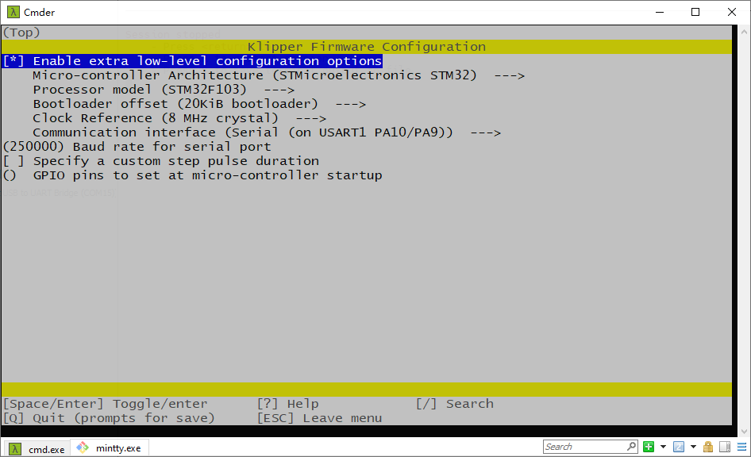
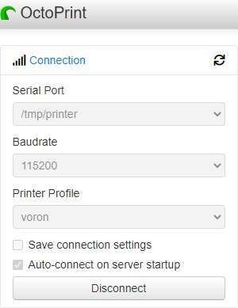

# Bootloader
This is the bootloader for FYSETC Cheetah board.

## Upload bootloader

### Method 1: Upload the bootloader(windows)

This method only works in windows system. You can follow the following steps to upload the bootloader.

- Download the flash software in our github https://github.com/FYSETC/STM32Flasher


- Power the board with power supply and connect the board to your PC with USB cable

- Double the click `FlyMcu.exe` software


- Select `Reset@DTR low(<-3v),ISP @RTS High`

- Click "Port" to select the port of your USB 


- Select `Bootloader-Cheetah.hex` in the `Code File For Online ISP:` edit box. There is bootloader file named `Bootloader-Cheetah.hex` beside this `README` file. 


- At last, click  `Start ISP(p)` button to upload the firmware.


### Method 2 : Upload the bootloader(linux)

This method only works in Linux system.

#### Load usb driver

Delete the old version driver `/lib/modules/$(uname -r)/kernel/drivers/usb/serial/ch341.ko`

```
rm /lib/modules/$(uname -r)/kernel/drivers/usb/serial/ch341.ko
```

Download the CH34x driver(linux version) from our github

https://github.com/FYSETC/CH340-Driver

follow the `readme.txt` to make and load the driver .

If you want the driver load automatically every time your PC power up. You can copy the `ch34x.ko` file to 

directory `/lib/modules/$(uname -r)/kernel/drivers/usb/serial/` , and do

```
depmod 
```

#### Install stm32flash tool

First get the code

```
git clone https://git.code.sf.net/p/stm32flash/code stm32flash-code
```

Then follow the INSTALL file to install the software

#### Upload the bootloader

Connect the motherboard with USB cable and your PC. And do

```
dmesg
```

And you will get message like 


the ttyUSB0 is the port to communicate with the motherboard.

And then go the `Bootloader-Cheetah.hex` file location directory and do the follow command to upload the firmware

```
 stm32flash -w Bootloader-Cheetah.hex -v -i rts,-dtr /dev/ttyUSB0
```

## Follow-up work

### Marlin firmware

This bootloader default boot address is `0x8005000`, so if you want to use this bootloader you need to change the firmware  flash address to `0x8005000`.

You need to add the following lines to Marlin file `Marlin\buildroot\share\PlatformIO\scripts\fysetc_STM32F1.py`

```
# Relocate firmware from 0x08000000 to 0x08005000
for define in env['CPPDEFINES']:
    if define[0] == "VECT_TAB_ADDR":
        env['CPPDEFINES'].remove(define)
env['CPPDEFINES'].append(("VECT_TAB_ADDR", "0x08005000"))

custom_ld_script = os.path.abspath("buildroot/share/PlatformIO/ldscripts/fysetc_stm32f103rc.ld")
for i, flag in enumerate(env["LINKFLAGS"]):
    if "-Wl,-T" in flag:
        env["LINKFLAGS"][i] = "-Wl,-T" + custom_ld_script
    elif flag == "-T":
        env["LINKFLAGS"][i + 1] = custom_ld_script
```

You can add it after the line 

```
Import("env")
```

And change the following line in `Marlin\buildroot\share\PlatformIO\ldscripts\fysetc_stm32f103rc.ld`

```
rom (rx)  : ORIGIN = 0x08005000, LENGTH = 256K - 20K
```

And then rebuild the firmware.

### Klipper firmware

You need to select `20KiB bootloader`



**After you upload the firmware, please power down Cheetah first, then power on again.  And use the following octoprint parameter.**



## Upload firmware with sdcard

After you upload the bootloader and build the firmware, now you can upload it to the board with sdcard

1. Copy the `firmware.bin`( if you use `Klipper` firmware, please rename `klipper.bin` to `firmware.bin`) file to the SD card , you need to be sure the firmware name is `firmware.bin`. 
2. And then power off the machine.
3. Insert the SD card to the board.
4. Power on the machine. 
5. And wait for 20~40 seconds (larger the firmware, more time need), it will be done. 

You can check if the `firmware.bin` file in the sdcard have been changed to `old.bin`, if so, means success. if not: Try to upload the `bootloader` again or open an issue in our [github](https://github.com/FYSETC/FYSETC-Cheetah/issues).

