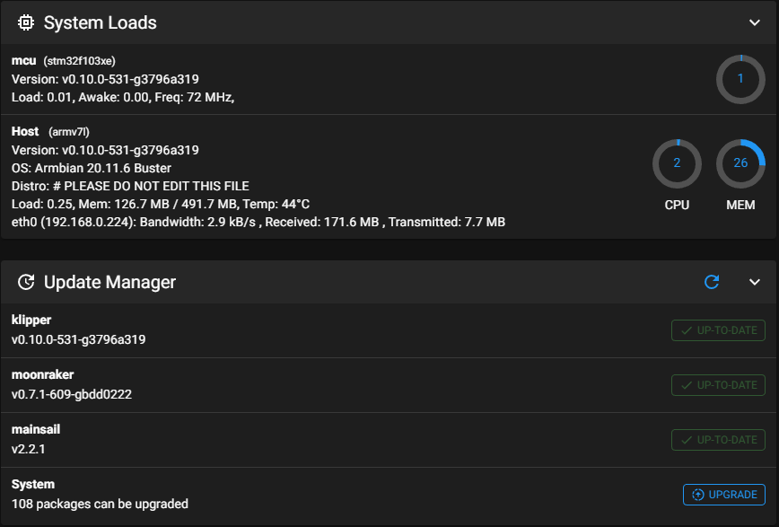
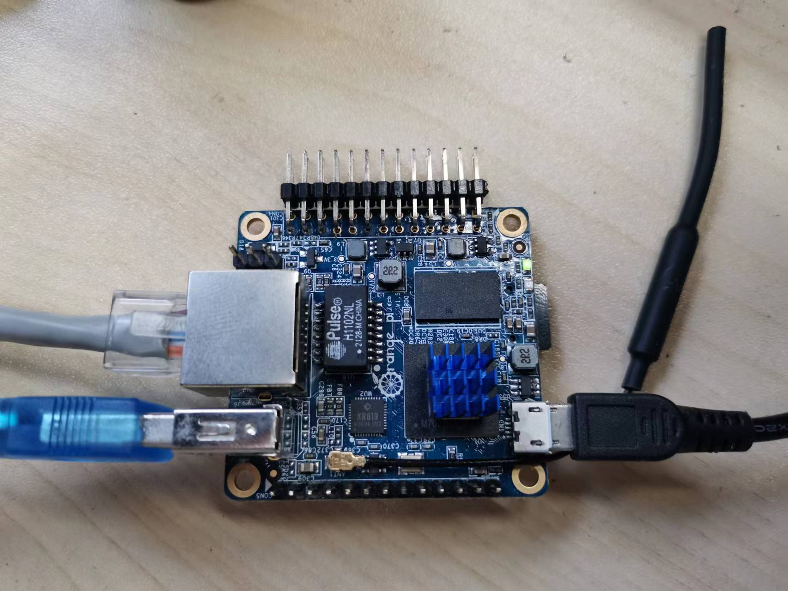
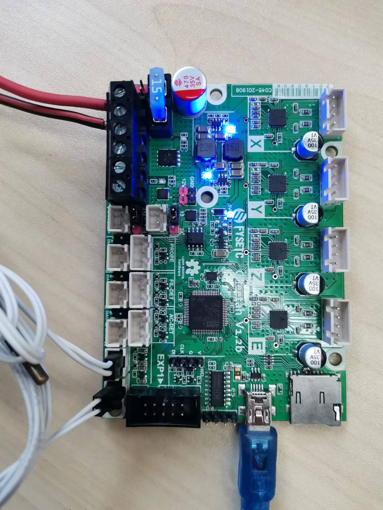

# Examples

This folder will contains machines that Cheetah board support. If you can't find your printer here , it does not mean Cheetah board does not support it , just because we don't add it at the moment. We strongly encourage you to make PR  for us and here is the [tutorial](https://docs.github.com/en/free-pro-team@latest/github/collaborating-with-issues-and-pull-requests/creating-a-pull-request). Thanks for your support.

## OrangePi-zero

We build an image base on `Armbian_20.11.6_Orangepizero_buster_current_5.10.4` mainsail OS for OrangePi-zero. You can download it from [Dropbox](https://www.dropbox.com/s/6tvu6on8kcejoij/Armbian_20.11.6_Orangepizero_buster_current_5.10.4_Cheetah_mainsail.img.ima?dl=0) and [百度云盘](https://pan.baidu.com/s/1XPlh9ovenJcJELMntx0g-w)（
提取码：1357）, remember you need an TF card with at least 8G capacity. The information of this image below.



### Step 1

Download and flash the OS image with `balenaEtcher` software to your TF card. Insert your flashed TF card to OrangePi-zero, and power on it. Connect Ethernet cable to OrangePi-zero. And find the ip address of OrangePi-zero from your router.



### Step 2

You can find the firmware `klipper.bin` in `Orangepi-zero` folder after you download the github repository. It is also stay in the OS path `klipper\out\klipper.bin` after you login the OS with SSH.

Original SSH account and password:

```
account: fysetc
password: fysetc123
```

Flash the firmware with the command below after you connect your OrangePi and Cheetah with USB cable.

```
stm32flash -w out/klipper.bin -v -i rts,-dtr,dtr /dev/ttyUSB0
```

Or follow the instructions [here](https://github.com/FYSETC/FYSETC-Cheetah#53-upload-the-firmware) for firmware uploading.



### Step 3:

I use the generic klipper config for this example, you need to change it according to your machine. Now visit the webpage with your orangepi-zero IP address. Good to go.
